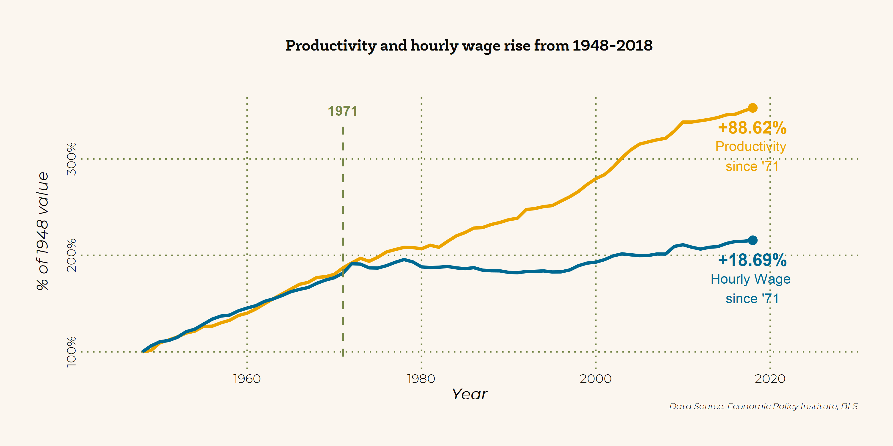
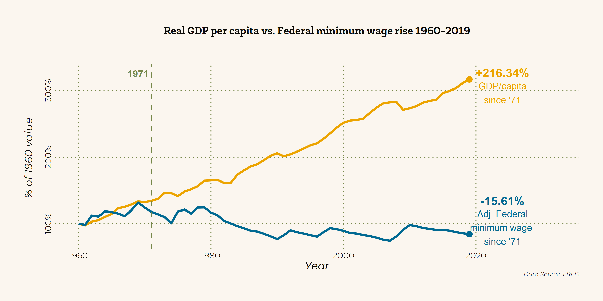
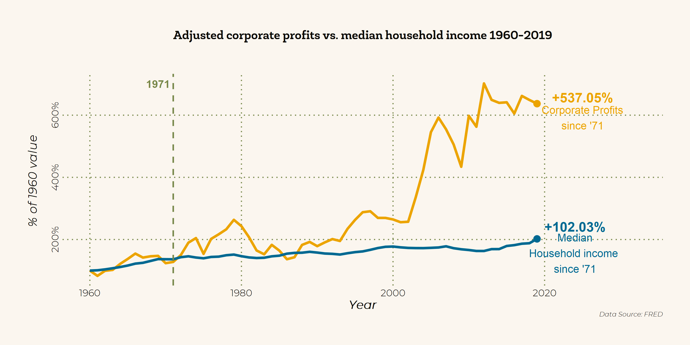
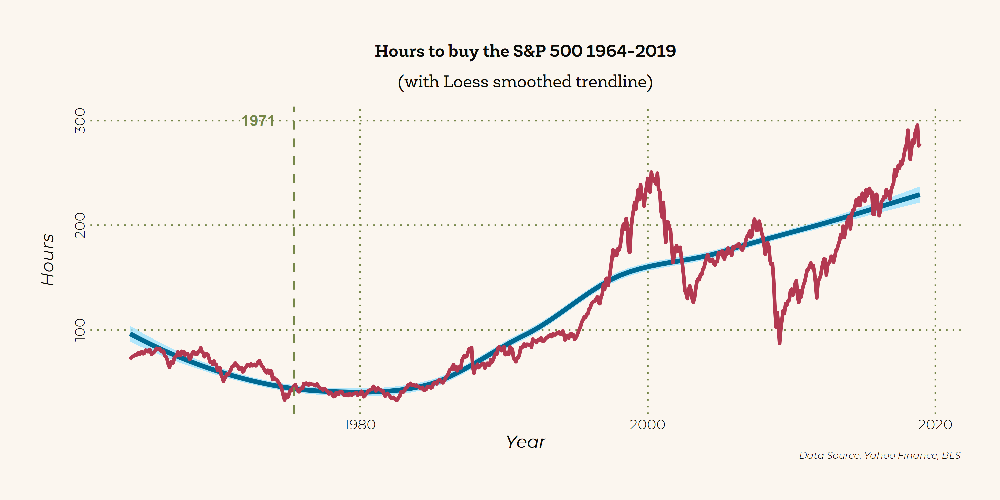
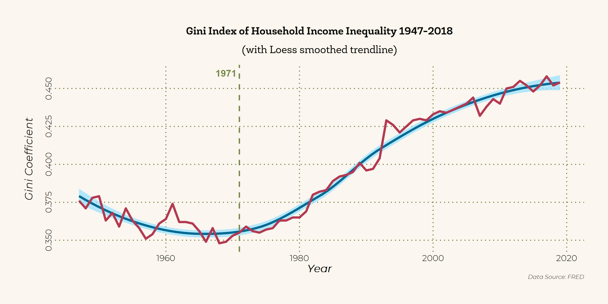

<br><br>

<div class="mycontent">

# Introduction

------------------------------------------------------------------------

After more than two decades of economic growth and relative progress, the beginning of the 70s decade signaled an inauspicious reversal: after a sustained period of rising budget deficits and high interest rate following the Johnson administration, Nixon's economic team started a massive upheaval in American, and by extension, global economic policy. This era of upheaval, otherwise inconspicuous to those outside of macroeconomic and political economy circles, would come to be known as the Nixon shock: the post-war economic system set up around the US as the world's primary gold reserve and by extension, around the US Dollar as the world's reserve currency was rapidly undone. The world after 1971 was poised to usher in an era radically different from its predecessor.

**This demonstration's purpose is to showcase the year 1971 and the following years as a watershed moment, both for domestic economy of the US and for the global economic system.** Through RStudio's data aggregation, manipulation, and visualisation suites and using publicly available economic data, I will be examining several key performance indices that might help us glean some insight into the post-Bretton Woods world order.

> It is important to note that this is not a policy or economic paper, nor will it attempt to delve deeply into the macroeconomic theory behind the Nixon shock or other developments in the 1970s. Such an analysis would fall beyond my expertise as a data visualisation enthusiast and political economy student. Whether the Shock was an unnecessary misstep by the Nixon administration, or an imperfect inevitability is decidedly beyond the scope of this demonstration, which is intended only to be a showcase for informative purposes.

# Setting up the R environment

------------------------------------------------------------------------

<details>

<summary>

This section briefly goes over the technical aspects of setting up R for creating the visualisations. The content here is chiefly for fellow R learners and enthusiasts. If you're more interested in the graphs, feel free to skip this section. Otherwise click here.

</summary>

## Packages

For the graphs in this demonstration, I will be using the *tidyverse* suite of packages for RStudio as the main toolset for data wrangling, cleaning, and visualisation through *ggplot2*. I will also be using *lubridate* for datetime manipulation, *stringr* for string manipulation, *fredr* for direct data fetching through the Federal Reserve Economic Data site provided by the Federal Reserve's API. For aesthetic customisation of the document, I use *patchwork* and *extrafont*.

```{r class.output="scroll-100", echo=TRUE, fig.align="center", fig.height=6, message=FALSE, warning=FALSE}
library(tidyverse)   # RStudio's suite of extended tools.
library(lubridate)   # For datetime manipulation
library(extrafont)   # For custom fonts.
library(fredr)       # For direct data fetching through FRED's API.
library(patchwork)   # For plot tiling.
library(kableExtra)  # For tables
```

## API Key

Should you the reader wish to replicate the plots in this demonstration, keep in mind that the fredr package connects through FRED's API, and thus requires an API key to be set. Here is a sample for the syntax to set an API key, but for your personal use you will need to sign up for a free account with FRED, and set your own API key.

```{r class.output="scroll-100", eval=FALSE,message=FALSE, warning=FALSE}
fredr_set_key("xxxxxxxxxxxxxxxxxxxxxxxxxxxxxxxx")
```

```{r include=FALSE}
fredr_set_key("fe0584c38504eccc993f49fe09fef128")
```

## Colour palette

I will also set a custom colour scale for use throughout different visualisations, for the sake of design continuity. The palettes are defined here, and displayed below. The colours and general design are inspired by vintage book covers by Pelican Books (and others in the same vein) from the 1970s.


```{r fig.align="center", fig.height=6, fig.width=6, message=FALSE, warning=FALSE}
palette_prim  <- c("#ECA400", 
                   "#006992", 
                   "#b33951")
palette_2nd   <- c("#FFD470", 
                   "#99E2FF",
                   "#DD92A1")
palette_tert  <- c("#FBF6EF",
                   "#0B0A07")
palette_grid  <- c("#768749")

scales::show_col(palette_prim %>% 
                   append(palette_2nd) %>% 
                   append(palette_grid) %>% 
                   append(palette_tert),
                 border = NA)
```

## Custom ggplot2 theme {.tabset .tabset-fade .tabset-pills}

To avoid repetition in constructing the plots, I predefine a custom theme based on ggplot2's *theme_minimal()* here.

### Theme Code

```{r class.output="scroll-100", message=FALSE, warning=FALSE}
theme_pelican70 <- function () { 
  theme_minimal(base_size=12.5, base_family="Montserrat Light") %+replace%
    theme(
      panel.background      = element_rect(fill = palette_tert[1], colour=NA),
      plot.background       = element_rect(fill = palette_tert[1], colour=NA),
      
      legend.background     = element_rect(fill = "transparent", colour=NA),
      legend.key            = element_rect(fill = "transparent", colour=NA),
      
      plot.margin           = unit(c(t=1,r=1,b=1,l=1),"cm"),
      
      plot.title            = element_text(family = "Newslab Bold",
                                           color = palette_tert[2],
                                           margin = margin(t = 2,
                                                           b = 8,
                                                           unit = "pt")),
      plot.subtitle         = element_text(family = "Newslab",
                                           color = palette_tert[2],
                                           margin = margin(t = 2,
                                                           b = 12,
                                                           unit = "pt")),
      axis.text.y           = element_text(angle = 90,
                                           color=palette_tert[2]),
      axis.text.x           = element_text(color=palette_tert[2]),
      axis.title.x          = element_text(color=palette_tert[2],
                                           face="bold.italic",
                                           margin = margin(t = 2,
                                                           b = 2,
                                                           unit = "pt")),
      axis.title.y          = element_text(color=palette_tert[2],
                                           angle = 90,
                                           face="bold.italic",
                                           margin = margin(t = 2,
                                                           b = 2,
                                                           unit = "pt")),
      strip.text.x          = element_blank(),
      
      panel.grid.major.x    = element_line(linetype = "dotted",
                                           colour = palette_grid),
      panel.grid.major.y    = element_line(linetype = "dotted",
                                           colour = palette_grid),
      panel.grid.minor.x    = element_blank(),
      panel.grid.minor.y    = element_blank(),
      
      plot.caption          = element_text(color=palette_tert[2],
                                           face="italic",
                                           size=7,
                                           hjust = 1,
                                           vjust = 1),
      plot.caption.position = "plot"
    )
}
```

### Plot Example

```{r fig.align="center", fig.height=6, fig.width=6, message=FALSE, warning=FALSE}
ggplot(data=mtcars,
       aes(as.factor(gear),mpg,fill=as.factor(gear)))+
  geom_boxplot(col=palette_tert[2])+
  geom_jitter()+
  scale_fill_manual(values = palette_prim)+
  theme_pelican70()+
  labs(title="Example with mtcars dataset: Mileage by gear number",
       x = "Gears",y="Miles per Gallon", fill = "Gears")

```

</detail>


# The Story of 1971

## Domestic Decoupling of the US Economy

------------------------------------------------------------------------

This section focuses chiefly on how most of the economic growth post-71 in the US has been decoupled from the realities of the average American worker.

The shared prosperity following the end of WW2 would have one believe in "a rising tide lifts all boats" - but this seemed to have stopped being true after 1971, especially for the middle class and working class in the US. In this section, we examine the various ways in which the common American worker has not shared in the continued economic growth since what I call the great decoupling that took place around 1971.

### Productivity vs. Wages {.tabset .tabset-fade .tabset-pills}

This first plot is probably the most well known: as much as labour productivity has continued to rise, since the 70s, wages have stagnated when adjusted for inflation. Using data from the Economic Policy Institute, here I recreate the plot of relative percentage rise in productivity for all workers and of hourly wage across the US.

Here, we can see clearly that in the few years after 1971, the general rate of increase for wages fell precipitously while productivity continues its previous trajectory. The growing economy had left the worker behind.

#### Plot

```{r out.width='100%', echo=FALSE}

```

#### Code

```{r class.output="scroll-100", message=FALSE, warning=FALSE, eval = FALSE}
prod_wage <- read_csv("data/productivity_wage.csv") %>%
  mutate_all(funs(str_replace(., "%", ""))) %>%
  mutate_all(funs(str_squish(.))) %>%
  transmute(
    year = as.numeric(Year),
    wage48 = (as.numeric(`Hourly compensation`)+100)/100,
    prod48 = (as.numeric(`Net productivity`)+100)/100
  )

w71 <- prod_wage[prod_wage$year==1971,]$wage48
p71 <- prod_wage[prod_wage$year==1971,]$prod48

prod_wage71 <- prod_wage %>% 
  transmute(
    year = year,
    wage71 = as.numeric(format(round(wage48/w71, 4), nsmall = 4)),
    prod71 = as.numeric(format(round(prod48/p71, 4), nsmall = 4))
  ) %>% 
  filter(year > 1971)

plot_prod_wage <- prod_wage %>%
  pivot_longer(cols = -year,
               names_to = "var",
               values_to = "y") %>%
  mutate(y = (y)) %>%
  ggplot(aes(
    x = year,
    y = y,
    col = var,
    group = var,
    text = paste(sep = "",
                 "Year: ",year,
                 "\n% of 1948: ",y*100,"%")
  )) +
  geom_line(size = 1.25) +
  
  theme_pelican70() +
  scale_color_manual(values = palette_prim) +
  
  scale_x_continuous(breaks = seq(1948, 2018, 8)) +
  scale_y_continuous(labels = scales::percent,
                     breaks = seq(1, 3, 1)) +
  xlim(1945, 2026) +
  
  annotate(
    "text",
    x = max(prod_wage$year),
    y = (prod_wage$wage48 %>% last()) - .5,
    label = "Hourly Wage \nsince '71",
    fontface = 1,
    col = palette_prim[2]
  ) +
  annotate(
    "text",
    x = max(prod_wage$year),
    y = (prod_wage$prod48 %>% last()) - .5,
    label = "Productivity \nsince '71",
    fontface = 1,
    col = palette_prim[1]
  ) +
  
  annotate(
    "point",
    size = 3,
    x = max(prod_wage$year),
    y = (prod_wage$prod48 %>% last()),
    col = palette_prim[1]
  ) +
  annotate(
    "point",
    size = 3,
    x = max(prod_wage$year),
    y = (prod_wage$wage48 %>% last()),
    col = palette_prim[2]
  ) +
  
  annotate(
    "text",
    x = max(prod_wage$year),
    y = (prod_wage$prod48 %>% last()) - .20,
    label = paste("+",
                  ((
                    prod_wage71$prod71 %>% last()
                  ) - 1) * 100,
                  "%",
                  sep = ""),
    fontface = 2,
    size = 5,
    col = palette_prim[1]
  ) +
  annotate(
    "text",
    x = max(prod_wage$year),
    y = (prod_wage$wage48 %>% last()) - .20,
    label = paste("+",
                  ((
                    prod_wage71$wage71 %>% last()
                  ) - 1) * 100,
                  "%",
                  sep = ""),
    fontface = 2,
    size = 5,
    col = palette_prim[2]
  ) +
  
  annotate(
    "segment",
    x = 1971,
    xend = 1971,
    y = .95,
    yend = 3.35,
    linetype = "dashed",
    size = 0.75,
    col = palette_grid
  ) +
  annotate(
    "text",
    x = 1971,
    y = 3.50,
    label = "1971",
    fontface = 2,
    col = palette_grid
  ) +
  
  labs(
    title = "Productivity and hourly wage rise from 1948-2018",
    subtitle = "",
    x = "Year",
    y = "% of 1948 value\n",
    caption = "Data Source: Economic Policy Institute, BLS"
  ) +
  
  theme(legend.position = "none")

ggsave(plot = plot_prod_wage,
       filename = "plots/plot_prod_wage.png",
       h = 5,
       w = 10,
       type = "cairo-png")

```

#### Data

```{r message=FALSE, warning=FALSE, paged.print=TRUE, echo = FALSE}
read_csv("data/productivity_wage.csv") %>%
  mutate_all(funs(str_replace(., "%", ""))) %>%
  mutate_all(funs(str_squish(.))) %>%
  transmute(
    Year = as.numeric(Year),
    `Hourly Wage` = (as.numeric(`Hourly compensation`)+100)/100,
    `Labour Productivity` = (as.numeric(`Net productivity`)+100)/100
  ) %>% 
  kbl() %>% 
  kable_styling(bootstrap_options = c("striped", "hover", "condensed")) %>% 
  scroll_box(width = "100%", height = "500px")

```

### GDP per Capita vs. Federal Minimum Wage {.tabset .tabset-fade .tabset-pills}

To further demonstrate that prosperity in the economy at large has not trickled down to the working class, this plot shows that while GDP per capita has risen greatly since '71, the inflation-adjusted value of the federal minimum wage level has actually fallen sine 1971.

#### Plot

```{r out.width='100%', echo=FALSE}

```

#### Code

```{r class.output="scroll-100", message=FALSE, warning=FALSE, eval = FALSE}
minwage_gdpcapita <- fredr(
  series_id = "FEDMINNFRWG",
  observation_start = as.Date("1960-01-01"),
  observation_end = as.Date("2019-01-02")
) %>% rbind(
  fredr(
    series_id = "USACPIALLMINMEI",
    observation_start = as.Date("1960-01-01"),
    observation_end = as.Date("2019-01-02")
  )
) %>% 
  pivot_wider(
    id_cols = date,
    names_from = series_id,
    values_from = value
  ) %>% 
  mutate(
    adj_minwage = FEDMINNFRWG/USACPIALLMINMEI*100
  ) %>% 
  filter(month(date) == 1) %>% 
  select(date,adj_minwage) %>% 
  pivot_longer(
    cols = -date,
    names_to = "series_id",
    values_to = "value"
  ) %>% 
  rbind(
    fredr(
      series_id = "A939RX0Q048SBEA",
      observation_start = as.Date("1960-01-01"),
      observation_end = as.Date("2019-01-02")
    )
  ) %>% 
  filter(month(date) == 1) %>% 
  mutate(date = year(date)) %>% 
  group_by(series_id) %>% 
  mutate(
    val_adj = value/first(value)
  ) 

last_val_gdp <- last(minwage_gdpcapita[minwage_gdpcapita$series_id == "A939RX0Q048SBEA",]$val_adj)
last_val_fmw <- last(minwage_gdpcapita[minwage_gdpcapita$series_id == "adj_minwage",]$val_adj)

text_gdp <- paste("+",
                  as.numeric(format(round((last_val_gdp-1)*100, 2), nsmall = 2)),
                  "%",
                  sep = "")
text_fmw <- paste("-",
                  as.numeric(format(round((1-last_val_fmw)*100, 2), nsmall = 2)),
                  "%",
                  sep = "")

plot_minwage_gdppc <- minwage_gdpcapita %>% 
  ggplot(
    aes(
      x = date,
      y = val_adj,
      col = series_id
    )
  ) + 
  geom_line(size=1.25)+
  geom_vline(
    xintercept = 1971,
    linetype = "dashed",
    size = 0.75,
    col = palette_grid
  )+
    
  xlim(1960,2032)+
  ylim(1,3.6)+
  
  scale_color_manual(values=palette_prim)+
  scale_y_continuous(labels = scales::percent,
                     breaks = seq(1, 3, 1))+
  theme_pelican70()+
  labs(
    title = "Real GDP per capita vs. Federal minimum wage rise 1960-2019",
    subtitle = "",
    x = "Year",
    y = "% of 1960 value \n",
    caption = "Data Source: FRED"
  ) +

  annotate("point",
           x = 2019,
           y = last_val_gdp,
           col = palette_prim[1],
           size=3)+
  annotate("point",
           x = 2019,
           y = last_val_fmw,
           col = palette_prim[2],
           size=3)+
  
  annotate("text",
           x = 2024,
           y = last_val_gdp+.1,
           label = text_gdp,
           col = palette_prim[1],
           fontface = 2,
           size = 5
  )+
  annotate("text",
           x = 2024,
           y = last_val_fmw+.5,
           label = text_fmw,
           col = palette_prim[2],
           fontface = 2,
           size = 5
  )+
  
  annotate("text",
           x = 2024,
           y = last_val_gdp-.1,
           label = "\n GDP/capita \nsince '71",
           col = palette_prim[1],
           size = 4
  )+
  annotate("text",
           x = 2024,
           y = last_val_fmw+.2,
           label = "\n Adj. Federal \nminimum wage \nsince '71",
           col = palette_prim[2],
           size = 4
  )+
  annotate(
    "text",
    x = 1969,
    y = 3.25,
    label = "1971",
    fontface = 2,
    col = palette_grid
  ) +
  
  theme(legend.position = "none")

ggsave(plot = plot_minwage_gdppc,
       filename = "plots/plot_minwage_gdppc.png",
       h = 5,
       w = 10,
       type = "cairo-png")
```

#### Data

```{r message=FALSE, warning=FALSE, paged.print=TRUE, echo = FALSE}
fredr(
  series_id = "FEDMINNFRWG",
  observation_start = as.Date("1960-01-01"),
  observation_end = as.Date("2019-01-02")
) %>% rbind(
  fredr(
    series_id = "USACPIALLMINMEI",
    observation_start = as.Date("1960-01-01"),
    observation_end = as.Date("2019-01-02")
  )
) %>% 
  pivot_wider(
    id_cols = date,
    names_from = series_id,
    values_from = value
  ) %>% 
  mutate(
    adj_minwage = FEDMINNFRWG/USACPIALLMINMEI*100
  ) %>% 
  filter(month(date) == 1) %>% 
  select(date,adj_minwage) %>% 
  pivot_longer(
    cols = -date,
    names_to = "series_id",
    values_to = "value"
  ) %>% 
  rbind(
    fredr(
      series_id = "A939RX0Q048SBEA",
      observation_start = as.Date("1960-01-01"),
      observation_end = as.Date("2019-01-02")
    )
  ) %>% 
  filter(month(date) == 1) %>% 
  mutate(date = year(date)) %>% 
  group_by(series_id) %>% 
  mutate(
    val_adj = value/first(value)
  ) %>% 
  pivot_wider(
    id_cols = date,
    names_from = series_id,
    values_from = value
  ) %>% 
  rename(
    Year = date,
    `Adj. Federal Min. Wage` = adj_minwage,
    `Adj. GDP per capita` = A939RX0Q048SBEA
  ) %>% 
  kbl() %>% 
  kable_styling(bootstrap_options = c("striped", "hover", "condensed")) %>% 
  scroll_box(width = "100%", height = "500px")

```

### Corporate Profits vs. Median Household Income {.tabset .tabset-fade .tabset-pills}

An even more dramatic rise can be seen in corporate profits since: aggregate corporate profits after tax has skyrocketed sixfold, but median household income has only doubled in the same time period. Both time series here are adjusted for inflation with a CPI deflator (2018 dollars). Granted, the trajectory for corporate profits is a lot more choppy (especially around the 2008 Global Financial Crisis), even in that era corporate profit still outstrips median household income by more than twice as much.

#### Plot

```{r out.width='100%', echo=FALSE}

```

#### Code

```{r class.output="scroll-100", message=FALSE, warning=FALSE, eval = FALSE}
corp_medincome <- fredr(
  series_id = "CP",
  observation_start = as.Date("1960-01-01"),
  observation_end = as.Date("2019-01-02")
) %>% rbind(
  fredr(
    series_id = "USACPIALLMINMEI",
    observation_start = as.Date("1960-01-01"),
    observation_end = as.Date("2019-01-02")
  )
) %>% 
  pivot_wider(
    id_cols = date,
    names_from = series_id,
    values_from = value
  ) %>% 
  mutate(
    adj = CP/USACPIALLMINMEI*100
  ) %>% 
  filter(month(date) == 1) %>% 
  select(date,adj) %>% 
  pivot_longer(
    cols = -date,
    names_to = "series_id",
    values_to = "value"
  ) %>% 
  rbind(
    fredr(
      series_id = "MEFAINUSA672N",
      observation_start = as.Date("1960-01-01"),
      observation_end = as.Date("2019-01-02")
    )
  ) %>% 
  filter(month(date) == 1) %>% 
  mutate(date = year(date)) %>% 
  group_by(series_id) %>% 
  mutate(
    val_adj = value/first(value)
  )


last_val_crp <- last(corp_medincome[corp_medincome$series_id == "adj",]$val_adj)
last_val_mhi <- last(corp_medincome[corp_medincome$series_id == "MEFAINUSA672N",]$val_adj)

text_crp <- paste("+",
                  as.numeric(format(round((last_val_crp-1)*100, 2), nsmall = 2)),
                  "%",
                  sep = "")
text_mhi <- paste("+",
                  as.numeric(format(round((last_val_mhi-1)*100, 2), nsmall = 2)),
                  "%",
                  sep = "")

plot_corp_medincome <- corp_medincome %>% 
  ggplot(
    aes(
      x = date,
      y = val_adj,
      col = series_id
    )
  ) + 
  geom_line(size=1.25)+
  geom_vline(
    xintercept = 1971,
    linetype = "dashed",
    size = 0.75,
    col = palette_grid
  )+
    
  xlim(1960,2032)+
  ylim(1,3.6)+
  
  scale_color_manual(values=palette_prim)+
  scale_y_continuous(labels = scales::percent)+
  theme_pelican70()+
  labs(
    title = "Adjusted corporate profits vs. median household income 1960-2019",
    subtitle = "",
    x = "Year",
    y = "% of 1960 value \n",
    caption = "Data Source: FRED"
  ) +

  annotate("point",
           x = 2019,
           y = last_val_crp,
           col = palette_prim[1],
           size=3)+
  annotate("point",
           x = 2019,
           y = last_val_mhi,
           col = palette_prim[2],
           size=3)+
  
  annotate("text",
           x = 2025,
           y = last_val_crp+.2,
           label = text_crp,
           col = palette_prim[1],
           fontface = 2,
           size = 5
  )+
  annotate("text",
           x = 2024,
           y = last_val_mhi+.39,
           label = text_mhi,
           col = palette_prim[2],
           fontface = 2,
           size = 5
  )+
  
  annotate("text",
           x = 2025,
           y = last_val_crp-.2,
           label = "\n Corporate Profits \nsince '71",
           col = palette_prim[1],
           size = 4
  )+
  annotate("text",
           x = 2024,
           y = last_val_mhi-.21,
           label = "\n Median \nHousehold income \nsince '71",
           col = palette_prim[2],
           size = 4
  )+
  annotate(
    "text",
    x = 1969,
    y = 7,
    label = "1971",
    fontface = 2,
    col = palette_grid
  ) +
  
  theme(legend.position = "none")

ggsave(plot = plot_corp_medincome,
       filename = "plots/plot_corp_medincome.png",
       h = 5,
       w = 10,
       type = "cairo-png")
```

#### Data

```{r message=FALSE, warning=FALSE, paged.print=TRUE, echo = FALSE}
fredr(
  series_id = "CP",
  observation_start = as.Date("1960-01-01"),
  observation_end = as.Date("2019-01-02")
) %>% rbind(
  fredr(
    series_id = "USACPIALLMINMEI",
    observation_start = as.Date("1960-01-01"),
    observation_end = as.Date("2019-01-02")
  )
) %>% 
  pivot_wider(
    id_cols = date,
    names_from = series_id,
    values_from = value
  ) %>% 
  mutate(
    adj = CP/USACPIALLMINMEI*100
  ) %>% 
  filter(month(date) == 1) %>% 
  select(date,adj) %>% 
  pivot_longer(
    cols = -date,
    names_to = "series_id",
    values_to = "value"
  ) %>% 
  rbind(
    fredr(
      series_id = "MEFAINUSA672N",
      observation_start = as.Date("1960-01-01"),
      observation_end = as.Date("2019-01-02")
    )
  ) %>% 
  filter(month(date) == 1) %>% 
  mutate(date = year(date)) %>% 
  group_by(series_id) %>% 
  mutate(
    val_adj = value/first(value)
  ) %>% 
  pivot_wider(
    id_cols = date,
    names_from = series_id,
    values_from = value
  ) %>% 
  rename(
    Year = date,
    `Corporate Profits After Tax (billions)` = adj,
    `Real Median Family Income` = MEFAINUSA672N
  ) %>% 
  kbl() %>% 
  kable_styling(bootstrap_options = c("striped", "hover", "condensed")) %>% 
  scroll_box(width = "100%", height = "500px")

```

### Wage Labour Hours to buy into Stock Market Indices {.tabset .tabset-fade .tabset-pills}

Without government pension programmes, US workers often rely on retirement accounts to prepare for the future. A large amount of this capital stored in retirement accounts (401k, etc.), a large portion of which is distributed into major market indices, such as the Dow Jones Industrial Average (\^DJI), the S&P 500 (\^GSPC), or the Russell 2000 (\^RUT). But when corporate profitability is high compared to hourly wage, the average worker might have had a more difficult time hitching themselves to the profit ride that the stock market has been riding on. Here, I decided to base my analysis on how many hours it would take for a worker to buy the value of the S&P 500 - mostly because the S&P 500 and its derivative products have had a history of being a popular investment.

Admittedly the trend reversal here appears to be delayed - at least a couple of years after 1971 itself. Still, I believe this trend still fits with the overall theme: since the 70s, the average worker has had to work nearly ten times the amount of hours to buy into the most popular investment instrument.

#### Plot

```{r out.width='100%', echo=FALSE}

```

#### Code

Here I call two extra packages called *tidyquant* and *quantmod* to fetch and manipulate stock market data.

```{r class.output="scroll-100", message=FALSE, warning=FALSE, eval = FALSE}
library(tidyquant)
library(quantmod)

sp500 <- read_csv("data/avg_hourly_earning.csv") %>% 
  pivot_longer(cols = -Year,
               names_to = "month",
               values_to ="value") %>% 
  mutate(rtime = paste("01",month,Year,sep=" "),
         date = dmy(rtime),
         series_id = "avg_hourly_wage") %>% 
  select(date,series_id,value) %>% 
  rbind(
  fredr(
    series_id = "USACPIALLMINMEI",
    observation_start = as.Date("1960-01-01"),
    observation_end = as.Date("2019-01-02")
  )
) %>% 
  mutate(series_id = ifelse(series_id == "USACPIALLMINMEI", "cpi",series_id)) %>% 
  pivot_wider(
    id_cols = date,
    names_from = series_id,
    values_from = value
  ) %>% 
  mutate(wage = avg_hourly_wage * cpi / 100) %>% 
  select(date,wage) %>% 
  filter(!is.na(wage)) %>% 
  left_join(getSymbols("^GSPC",
           from = "1964-01-01",
           to = "2019-01-01",
           src = "yahoo",
           auto.assign=F) %>% 
  as.data.frame() %>% 
  rownames_to_column("date") %>% 
  select(date,sp500 = GSPC.Close) %>% 
  mutate(date = as.Date(date),
         year = year(date),
         month = month(date)) %>% 
  group_by(year,month) %>% 
  summarise(sp500 = first(sp500)) %>% 
  ungroup() %>% 
  mutate(date = paste(year,month,"01",sep="-") %>% ymd(),
            sp500 = sp500) %>% 
  select(date,sp500)) %>% 
  mutate(hour_to_buy = sp500/wage) 

plot_sp500 <- sp500 %>% 
  ggplot(
    aes(
      x = date,
      y = hour_to_buy
    )
  )+
  geom_smooth(col   = palette_prim[2],
              fill  = palette_2nd[2],
              size  = 1.6,
              alpha = .75)+
  geom_line(col  = palette_prim[3],
            size = 1.25)+
  geom_vline(
    xintercept = 1971,
    linetype = "dashed",
    size = 0.75,
    col = palette_grid
  )+
  theme_pelican70()+
  labs(
    title = "Hours to buy the S&P 500 1964-2019",
    subtitle = "(with Loess smoothed trendline)",
    x = "Year",
    y = "Hours\n",
    caption = "Data Source: Yahoo Finance, BLS"
  ) + 
  theme(legend.position = "none")+
  annotate(
    "text",
    x = as.Date("1972-12-01"),
    y = 300,
    label = "1971",
    fontface = 2,
    col = palette_grid
  )

ggsave(plot = plot_sp500,
       filename = "plots/plot_sp500.png",
       h = 5,
       w = 10,
       type = "cairo-png")
```

#### Data

```{r message=FALSE, warning=FALSE, paged.print=TRUE, echo = FALSE}
read_csv("data/avg_hourly_earning.csv") %>% 
  pivot_longer(cols = -Year,
               names_to = "month",
               values_to ="value") %>% 
  mutate(rtime = paste("01",month,Year,sep=" "),
         date = dmy(rtime),
         series_id = "avg_hourly_wage") %>% 
  select(date,series_id,value) %>% 
  rbind(
  fredr(
    series_id = "USACPIALLMINMEI",
    observation_start = as.Date("1960-01-01"),
    observation_end = as.Date("2019-01-02")
  )
) %>% 
  mutate(series_id = ifelse(series_id == "USACPIALLMINMEI", "cpi",series_id)) %>% 
  pivot_wider(
    id_cols = date,
    names_from = series_id,
    values_from = value
  ) %>% 
  mutate(wage = avg_hourly_wage * cpi / 100) %>% 
  select(date,wage) %>% 
  filter(!is.na(wage)) %>% 
  left_join(quantmod::getSymbols("^GSPC",
           from = "1964-01-01",
           to = "2019-01-01",
           src = "yahoo",
           auto.assign=F) %>% 
  as.data.frame() %>% 
  rownames_to_column("date") %>% 
  select(date,sp500 = GSPC.Close) %>% 
  mutate(date = as.Date(date),
         year = year(date),
         month = month(date)) %>% 
  group_by(year,month) %>% 
  summarise(sp500 = first(sp500)) %>% 
  ungroup() %>% 
  mutate(date = paste(year,month,"01",sep="-") %>% ymd(),
            sp500 = sp500) %>% 
  select(date,sp500)) %>% 
  mutate(hour_to_buy = sp500/wage) %>% 
  transmute(`Year & Month` = paste(year(date),month(date),sep="-"),
            `Avg. Nominal Hourly Wage for Nonmanagement Workers` = wage,
            `S&P500 Nominal Value` = sp500,
            `Labour Hours to Buy S&P500` = hour_to_buy
            ) %>% 
  kbl() %>% 
  kable_styling(bootstrap_options = c("striped", "hover", "condensed")) %>% 
  scroll_box(width = "100%", height = "500px")
```

### CEO-to-worker Compensation Ratio {.tabset .tabset-fade .tabset-pills}

And this precipitous increase in corporate profits and valuation, having not trickled down to the middle class, appears to have mostly gone to the corporate executives of America. While in the 60s and early 70s, a CEO only earned about 20x to 25x the amount their worker did, this ratio skyrocketed to more 320 by 2019. This change may not have taken place dramatically in the year 1971, but it can be argued that the decade following '71 was a long process of trend reversal from relative parity to the outsized ratio of modern America.

#### Plot

```{r out.width='100%', echo=FALSE}

```

#### Code

```{r class.output="scroll-100", message=FALSE, warning=FALSE, eval = FALSE}
plot_ceo_ratio <- read_csv("data/ceo_comp.csv") %>% 
  mutate(
    realized = realized %>% str_extract("^\\d+.{0,1}\\d+") %>% as.numeric()
  ) %>% 
  ggplot(
    aes(
      x = year,
      y = realized
    )
  )+
  geom_smooth(col   = palette_prim[2],
              fill  = palette_2nd[2],
              size  = 1.6,
              alpha = .75)+
  geom_line(col  = palette_prim[3],
            size = 1.25)+
  geom_vline(
    xintercept = 1971,
    linetype = "dashed",
    size = 0.75,
    col = palette_grid
  )+
  theme_pelican70()+
  labs(
    title = "CEO-worker compensation ratio 1965-2019",
    subtitle = "(with Loess smoothed trendline)",
    x = "Year",
    y = "Ratio\n",
    caption = "Data Source: Economic Policy Institute"
  ) +
  annotate(
    "text",
    x = 1969,
    y = 350,
    label = "1971",
    fontface = 2,
    col = palette_grid
  ) +
  theme(legend.position = "none")

ggsave(plot = plot_ceo_ratio,
       filename = "plots/plot_ceo_ratio.png",
       h = 5,
       w = 10,
       type = "cairo-png")
```

#### Data

```{r message=FALSE, warning=FALSE, paged.print=TRUE, echo = FALSE}
read_csv("data/ceo_comp.csv") %>% 
  transmute(
    Year = as.numeric(year),
    `Realized Compensation Ratio` = realized %>% str_extract("^\\d+.{0,1}\\d+") %>% as.numeric()
  ) %>% 
  kbl() %>% 
  kable_styling(bootstrap_options = c("striped", "hover", "condensed")) %>% 
  scroll_box(width = "100%", height = "500px")

```

### Inequality 1: Gini Index {.tabset .tabset-fade .tabset-pills}

Unsurprisingly this previous pattern has corresponded with an increase in the Gini Index, measuring household income inequality. Here it is clear through the smoothed trendline that the years around 1971 were the bottom of the valley that signalled a trend reversal towards the massive inequality in modern America.

> +----------------------------------------------------------------------------------------------------------------------------------------------------------------------------------------------------------------------+
> | Definition of the Gini Index, from the OECD:                                                                                                                                                                         |
> |                                                                                                                                                                                                                      |
> | The Gini index measures the extent to which the distribution of income (or, in some cases, consumption expenditure) among individuals or households within an economy deviates from a perfectly equal distribution.\ |
> | \                                                                                                                                                                                                                    |
> | The Gini index measures the area between the Lorenz curve and the hypothetical line of absolute equality, expressed as a percentage of the maximum area under the line.\                                             |
> | \                                                                                                                                                                                                                    |
> | A Gini index of zero represents perfect equality and 1.00, perfect inequality.                                                                                                                                        |
> +----------------------------------------------------------------------------------------------------------------------------------------------------------------------------------------------------------------------+

#### Plot

```{r out.width='100%', echo=FALSE}

```

#### Code

```{r class.output="scroll-100", message=FALSE, warning=FALSE, eval = FALSE}
gini <- fredr(
  series_id = "GINIALLRF",
  observation_start = as.Date("1800-01-01"),
  observation_end = as.Date(Sys.Date())
) 

plot_gini <- gini %>% 
  mutate(date = year(date)) %>% 
  ggplot(
    aes(
      x = date,
      y = value
    )
  ) + 
  geom_smooth(col   = palette_prim[2],
              fill  = palette_2nd[2],
              size  = 1.25,
              alpha = .75)+
  geom_line(col  = palette_prim[3],
            size = 1.25)+
  geom_vline(
    xintercept = 1971,
    linetype = "dashed",
    size = 0.75,
    col = palette_grid
  )+
  theme_pelican70()+
  labs(
    title = "Gini Index of Household Income Inequality 1947-2018",
    subtitle = "(with Loess smoothed trendline)",
    x = "Year",
    y = "Gini Coefficient \n",
    caption = "Data Source: FRED"
  ) +
  annotate(
    "text",
    x = 1969,
    y = 0.46,
    label = "1971",
    fontface = 2,
    col = palette_grid
  ) +
  
  theme(legend.position = "none")

ggsave(plot = plot_gini,
       filename = "plots/plot_gini.png",
       h = 5,
       w = 10,
       type = "cairo-png")
```

#### Data

```{r message=FALSE, warning=FALSE, paged.print=TRUE, echo = FALSE}
fredr(
  series_id = "GINIALLRF",
  observation_start = as.Date("1800-01-01"),
  observation_end = as.Date(Sys.Date())
) %>% 
  mutate(date = year(date)) %>% 
  transmute(
    Year = as.numeric(date),
    `Gini Coeffcient` = value
  ) %>% 
  kbl() %>% 
  kable_styling(bootstrap_options = c("striped", "hover", "condensed")) %>% 
  scroll_box(width = "100%", height = "500px")

```

### Inequality 2: Top 10% as share of total income {.tabset .tabset-fade .tabset-pills}

In a similar pattern, while in the post-war era, the top 10% of earners in America accounted for an unprecedentedly small proportion of total income, this proportion started to increase dramatically again, with the trend reversal beginning around 1971. Data here is taken from Saez and Piketty's original research.

#### Plot

```{r out.width='100%', echo=FALSE}

```

#### Code

```{r class.output="scroll-100", message=FALSE, warning=FALSE, eval = FALSE}
plot_top10_incomeshare <- read_csv("data/fct_income_distro.csv") %>% 
  select(year,top10) %>% 
  pivot_longer(
    cols = -year,
    names_to = "pop",
    values_to = "share"
  ) %>% 
  ggplot(
    aes(
      x = year,
      y = share,
      col = pop
    )
  )+
  geom_smooth(col   = palette_prim[2],
              fill  = palette_2nd[2],
              size  = 1.6,
              alpha = .75)+
  geom_line(size = 1.25,
            col = palette_prim[3])+
  geom_vline(
    xintercept = 1971,
    linetype = "dashed",
    size = 0.75,
    col = palette_grid
  )+
  theme_pelican70()+
  scale_x_continuous(breaks = seq(1900,2020,20))+
  scale_y_continuous(labels = scales::percent)+
  labs(
    title = "Share of total income by top 10% earners 1913-2019",
    subtitle = "(with Loess smoothed trendline)",
    x = "Year",
    y = "% Share of total \n",
    caption = "Data Source: Piketty and Saez, 2019"
  ) +
  annotate(
    "text",
    x = 1968,
    y = 0.49,
    label = "1971",
    fontface = 2,
    col = palette_grid
  ) +
  theme(legend.position = "none")

ggsave(plot = plot_top10_incomeshare,
       filename = "plots/plot_top10_incomeshare.png",
       h = 5,
       w = 10,
       type = "cairo-png")
```

#### Data

```{r message=FALSE, warning=FALSE, paged.print=TRUE, echo = FALSE}

read_csv("data/fct_income_distro.csv") %>%
  rename(
    Year = year,
    `Top 10%` = top10,
    `Top 5%` = top5,
    `Top 1%` = top1,
    `Top 0.5%` = top.5,
    `Top 0.1%` = top.1,
    `Top 0.01%` = top.01
  ) %>% 
  kbl() %>% 
  kable_styling(bootstrap_options = c("striped", "hover", "condensed")) %>% 
  scroll_box(width = "100%", height = "500px")

```

### Inequality 3: Top 0.5% vs. bottom 90% as share of total wealth {.tabset .tabset-fade .tabset-pills}

Regarding economic inequality, analysing the distribution of wealth is every bit as important - if not more - than that of income. In this section, I have picked an even smaller slice (0.5%) to demonstrate the chasm that separates the vast majority of Americans and those at the top. 

From the beginning of the time series up until the 70s, the two proportions were trending towards overall higher equality, until the .5% richest began to hold more of total wealth once again after 1971. The trend reversal for wealth came later in the 70s decade - possibly as a lagging indicator resulting from the earlier reversal of income outlined in the previous section.

#### Plot

```{r out.width='100%', echo=FALSE}

```

#### Code

```{r class.output="scroll-100", message=FALSE, warning=FALSE, eval = FALSE}
plot_top.5_wealthshare <- read_csv("data/wealth_distro_top10_top.5.csv") %>% 
  mutate(bottom90 = 1-top10) %>% 
  select(year,top.5,bottom90) %>% 
  pivot_longer(
    cols = -year,
    names_to = "pop",
    values_to = "share"
  ) %>% 
  ggplot(
    aes(
      x = year,
      y = share,
      col = pop
    )
  )+
  geom_line(size=1.25)+
  
  scale_x_continuous(breaks = seq(1900,2020,20))+
  scale_color_manual(values = palette_prim)+
  scale_y_continuous(labels = scales::percent,
                     limits = c(.1,.43))+

  theme_pelican70()+
  
  labs(
    title = "Share of total wealth between \nbottom 90% and top 0.5% from 1913-2019",
    subtitle = "",
    x = "Year",
    y = "% Share of total \n",
    caption = "Data Source: Piketty and Saez, 2019"
  ) +
  
  annotate(
    "text",
    x = 1975,
    y = .42,
    label = "1970s",
    fontface = 2,
    col = palette_grid
  ) +
  
  annotate(
    "rect",
    xmin = 1970, xmax = 1980,
    ymin = -Inf, ymax = Inf,
    fill = palette_grid,
    col = palette_grid,
    alpha = .25
  ) +
  
  annotate(
    "text",
    x = 1998,
    y = .365,
    col = palette_prim[1],
    label = "Bottom 90%",
    fontface = 2,
    size = 4,
  ) +
  
  annotate(
    "text",
    x = 1996.5,
    y = .195,
    col = palette_prim[2],
    label = "Top 0.5%",
    fontface = 2,
    size = 4,
  ) +
  
  theme(legend.position = "none")

ggsave(plot = plot_top.5_wealthshare,
       filename = "plots/plot_top.5_wealthshare.png",
       h = 5,
       w = 10,
       type = "cairo-png")
```


#### Data

```{r message=FALSE, warning=FALSE, paged.print=TRUE, echo = FALSE}

read_csv("data/wealth_distro_top10_top.5.csv") %>% 
  mutate(bottom90 = 1-top10) %>% 
  select(year,top.5,bottom90) %>% 
  rename(
    Year = year,
    `Top 0.5%` = top.5,
    `Bottom 90%` = bottom90
  ) %>% 
  kbl() %>% 
  kable_styling(bootstrap_options = c("striped", "hover", "condensed")) %>% 
  scroll_box(width = "100%", height = "500px")

```


## Global Financial (Dis)Order

------------------------------------------------------------------------

This section focuses chiefly on how the global economy post-71 has also been an era of tumult for many countries' economies beyond the US.

1971 made its mark on the global economy with the collapse of the Bretton Woods system, which in turn had a ripple effect on economies beyond that of the United States. This era saw the return of banking crises, market crashes, and most directly currency hyperinflations or debasements - especially compared to the relative dearth of said crises in the 'golden era' of Bretton Woods. 

> Most of the visualisations in this section are based on data gathered by Carmen Reinhart and Kenneth Rogoff in their book *This Time Is Different: Eight Centuries of Financial Folly*. 
> Note that while the book's an impressive work of macroeconomics research, it has also been a source of significant controversy, specifically over the veracity of the book's central claims and conclusion. After replication on data supplied by the authors, many economists have critiqued Reinhart and Rogoff's conclusions as flawed by poor code, selective omission of data, and a litany of other issues with academic rigour. 
> With those concerns in mind, I have ensured to only use Reinhart and Rogoff's raw data and not the qualitative analysis or conclusions drawn by these authors, and whenever possible cross-reference data values with public records.  

### Major inflation or depreciation of currency {.tabset .tabset-fade .tabset-pills}

One central pillar of the Bretton Woods system is the status of the US Dollar as the world's reserve currency, backed by the Federal Reserve's accumulated gold. This can be argued to have had a stabilising effect on global currencies, as many were pegged to the US Dollar, the value of which stayed relatively stable. 

When the US Dollar's convertibility to gold was ended, most currencies were no longer anchored to a relatively stable value. Especially with the advent of modern monetary policy, most currencies have become free-floating *fiat* currency backed and controlled by central banks' control of the money supply. Easily observable in this new era is the returned propensity for inflationary crises suffered by many currencies (especially those of weaker economies, or in periods of global financial instability.)

#### Plot

```{r out.width='100%', echo=FALSE}

```

#### Code

```{r class.output="scroll-100", message=FALSE, warning=FALSE, eval = FALSE}
plot_inflations <- read_csv("data/inflations.csv") %>% 
  filter(year >= 1900) %>% 
  mutate(yroll = zoo::rollmean(inflation_eps, k = 5, fill = NA)) %>% 
  ggplot(aes(x = year)) + 
  
  annotate(
    "rect",
    xmin = 1945, xmax = 1971,
    ymin = -Inf, ymax = Inf,
    fill = palette_grid,
    alpha = .25
  ) +
  annotate(
    "text",
    x = 1958,
    y = 22,
    label = "Post-War\nBretton Woods",
    fontface = 2,
    col = palette_grid
  ) + 
  annotate(
    "rect",
    xmin = 1914, xmax = 1945,
    ymin = -Inf, ymax = Inf,
    fill = palette_prim[3],
    alpha = .25
  ) +
  annotate(
    "text",
    x = 1929,
    y = 22,
    label = "World Wars & \nInterwar Depression",
    fontface = 2,
    col = palette_prim[3]
  ) + 
  annotate(
    "text",
    x = 1974,
    y = 22,
    label = "1971",
    fontface = 2,
    col = palette_grid
  ) +
  
  geom_point(aes(y = inflation_eps),
             col = palette_prim[2],
             size=.25) + 
  geom_line(aes(y = yroll),
            col = palette_prim[1],
            size = 1.25)+
  geom_vline(
    xintercept = 1971,
    linetype = "dashed",
    size = 0.75,
    col = palette_grid
  )+
  theme_pelican70()+
    
  scale_x_continuous(breaks = seq(1800,2020,20))+
  
  labs(
    title = "Global Instances of Annual inflation greater than 15% from 1900-2000",
    subtitle = "(with 5-year moving average trendline)",
    x = "Year",
    y = "# of inflationary episodes \n",
    caption = "Data Source: Reinhart and Rogoff, 2009"
  )+
  
  theme(legend.position = "none")
  
  
ggsave(plot = plot_inflations,
       filename = "plots/plot_inflations.png",
       h = 5,
       w = 10,
       type = "cairo-png")
```


#### Data

```{r message=FALSE, warning=FALSE, paged.print=TRUE, echo = FALSE}

read_csv("data/inflations.csv") %>% 
  filter(year >= 1900) %>% 
  rename(
    Year = year,
    `Number of inflationary episodes` = inflation_eps
  ) %>% 
  kbl() %>% 
  kable_styling(bootstrap_options = c("striped", "hover", "condensed")) %>% 
  scroll_box(width = "100%", height = "500px")

```

### Banking crises {.tabset .tabset-fade .tabset-pills}

Similarly, it would appear that the Bretton Woods system was correlated with a relative stability in terms of countries with a banking crisis (or multiple crises.) Serendipitously enough, the 5-year MA trendline started immediately picking up after 1971, and banking instability has remained high since. Note the outlier on the top right - this high value is representative of the Global Financial Crisis of 2008. 

#### Plot

```{r out.width='100%', echo=FALSE}

```

#### Code

```{r eval=FALSE, fig.height=5, fig.width=10, message=FALSE, warning=FALSE, class.output="scroll-100"}
plot_banking_crises <- read_csv("data/banking_crises.csv") %>% 
  filter(year >= 1900) %>% 
  mutate(yroll = zoo::rollmean(crises_eps, k = 5, fill = NA)) %>% 
  ggplot(aes(x = year)) + 
    
  annotate(
    "rect",
    xmin = 1945, xmax = 1971,
    ymin = -Inf, ymax = Inf,
    fill = palette_grid,
    alpha = .25
  ) +
  annotate(
    "text",
    x = 1958,
    y = 43.5,
    label = "Post-War\nBretton Woods",
    fontface = 2,
    col = palette_grid
  ) + 
  annotate(
    "rect",
    xmin = 1914, xmax = 1945,
    ymin = -Inf, ymax = Inf,
    fill = palette_prim[3],
    alpha = .25
  ) +
  annotate(
    "text",
    x = 1929,
    y = 43.5,
    label = "World Wars & \nInterwar Depression",
    fontface = 2,
    col = palette_prim[3]
  ) + 
  annotate(
    "text",
    x = 1974,
    y = 43.5,
    label = "1971",
    fontface = 2,
    col = palette_grid
  ) +
  

  geom_point(aes(y = crises_eps),
             col = palette_prim[2],
             size=.25) + 
  geom_line(aes(y = yroll),
            col = palette_prim[1],
            size = 1.25)+
  geom_vline(
    xintercept = 1971,
    linetype = "dashed",
    size = 0.75,
    col = palette_grid
  )+
  theme_pelican70()+
    
  scale_x_continuous(breaks = seq(1800,2020,20))+
  ylim(-3,45)+
  
  labs(
    title = "Banking crises weighted by share of world income 1900-2000",
    subtitle = "(with 5-year moving average trendline)",
    x = "Year",
    y = "Weighted count of crises \n",
    caption = "Data Source: Reinhart and Rogoff, 2009"
  )+
  theme(legend.position = "none")
  
  
ggsave(plot = plot_banking_crises,
       filename = "plots/plot_banking_crises.png",
       h = 5,
       w = 10,
       type = "cairo-png")
```


#### Data

```{r message=FALSE, warning=FALSE, paged.print=TRUE, echo = FALSE}

read_csv("data/banking_crises.csv") %>% 
  filter(year >= 1900) %>% 
  rename(
    Year = year,
    `Income-share-weighted Count of Banking Crises` = crises_eps
  ) %>% 
  kbl() %>% 
  kable_styling(bootstrap_options = c("striped", "hover", "condensed")) %>% 
  scroll_box(width = "100%", height = "500px")

```

<br><br><br>

</div>


### Sovereign Debt Credit Defaults or Restructuring {.tabset .tabset-fade .tabset-pills}

While the effect is delayed in the case of credit default and restructuring, a dramatic rise in the number of default events can also be observe in the decade past 1971, accelerating well into the 80s and 90s. Reinhart and Rogoff's sample population here does not contain all nations of the world, but is representative enough of different global economic regions.

#### Plot

```{r out.width='100%', echo=FALSE}

```

#### Code

```{r eval=FALSE, fig.height=5, fig.width=10, message=FALSE, warning=FALSE, class.output="scroll-100"}
plot_credit_default <- read_csv("data/credit_defaults.csv") %>% 
  filter(Year >= 1900) %>% 
  pivot_longer(
    cols = -Year,
    names_to = "Country",
    values_to = "is_default"
  ) %>% 
  mutate(
    Country = toupper(Country),
    is_default = replace_na(is_default,0)
  ) %>% 
  group_by(Year) %>% 
  summarise(
    n_default = mean(is_default)
  ) %>% 
  mutate(yroll = zoo::rollmean(n_default, k = 5, fill = NA)) %>%
  ggplot(aes(x = Year))+
  annotate(
    "rect",
    xmin = 1945, xmax = 1971,
    ymin = -Inf, ymax = Inf,
    fill = palette_grid,
    alpha = .25
  ) +
  annotate(
    "text",
    x = 1958,
    y = 0.42,
    label = "Post-War\nBretton Woods",
    fontface = 2,
    col = palette_grid
  ) + 
  annotate(
    "rect",
    xmin = 1914, xmax = 1945,
    ymin = -Inf, ymax = Inf,
    fill = palette_prim[3],
    alpha = .25
  ) +
  annotate(
    "text",
    x = 1929,
    y = 0.42,
    label = "World Wars & \nInterwar Depression",
    fontface = 2,
    col = palette_prim[3]
  ) + 
  annotate(
    "text",
    x = 1974,
    y = 0.42,
    label = "1971",
    fontface = 2,
    col = palette_grid
  ) +
  

  geom_point(aes(y = n_default),
             col = palette_prim[2],
             size=.25) + 
  geom_line(aes(y = yroll),
            col = palette_prim[1],
            size = 1.25)+
  geom_vline(
    xintercept = 1971,
    linetype = "dashed",
    size = 0.75,
    col = palette_grid
  )+
  theme_pelican70()+
    
  scale_x_continuous(breaks = seq(1800,2020,20))+
  scale_y_continuous(labels = scales::percent)+
  
  labs(
    title = "Proportion of Countries in a state of Credit Default or Restructuring 1900-2014",
    subtitle = "(with 5-year moving average trendline)",
    x = "Year",
    y = "\n",
    caption = "Data Source: Reinhart and Rogoff, 2014"
  )+
  theme(legend.position = "none")
  
  
ggsave(plot = plot_credit_default,
       filename = "plots/plot_credit_default.png",
       h = 5,
       w = 10,
       type = "cairo-png")
```


#### Data

```{r message=FALSE, warning=FALSE, paged.print=TRUE, echo = FALSE}

read_csv("data/credit_defaults.csv") %>% 
  filter(Year >= 1900) %>% 
  pivot_longer(
    cols = -Year,
    names_to = "Country",
    values_to = "is_default"
  ) %>% 
  transmute(
    Year = Year,
    Country = toupper(Country),
    `Is in Default or Debt Restructuring` = replace_na(is_default,0) %>% as.logical()
  ) %>% 
  kbl() %>% 
  kable_styling(bootstrap_options = c("striped", "hover", "condensed")) %>% 
  scroll_box(width = "100%", height = "500px")

```

<br><br><br>

</div>

